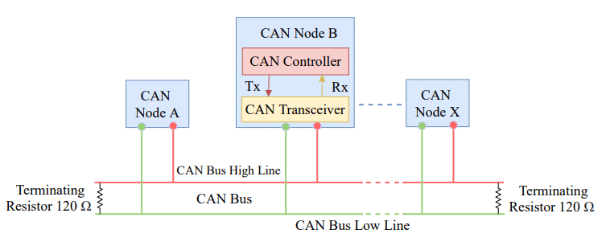

# Hướng dẫn thiết kế các chuẩn truyền thông

## Mục lục

- [Hướng dẫn thiết kế các chuẩn truyền thông](#hướng-dẫn-thiết-kế-các-chuẩn-truyền-thông)
	- [Mục lục](#mục-lục)
	- [I2C](#i2c)
	- [SPI](#spi)
	- [UART](#uart)
	- [1WIRE](#1wire)
	- [CAN](#can)
	- [USB](#usb)
		- [Giới thiệu](#giới-thiệu)
		- [Black Magic (?)](#black-magic-)

## I2C

I2C là chuẩn truyền thông nối tiếp đồng bộ, bán song công. I2C đơn giản và dễ sử dụng. Một bus I2C gồm hai dây dẫn:

- SDA: chân truyền dữ liệu
- SCL: chân clock

Giao tiếp trên I2C bus luôn có một ***Master*** (thường là vi điều khiển). Các thiết bị giao tiếp với Master là ***Slave***. Một Master có thể giao tiếp với tối đa 127 Slave trên cùng một bus I2C. Mỗi slave có một ***địa chỉ*** 7 bit, dùng để phân biệt giữa các slave.

Để nhiều thiết bị kết nối với cùng đường dây mà không bị xung đột, ngõ ra điều khiển hai dây SDA và SCL của các thiết bị trên bus **phải là kiểu open-drain (hở cực drain)**. Đây là kiểu ngõ ra mà chỉ có thể kéo đường dây (SDA và SCL) **xuống mức thấp (mức 0), mà không thể kéo lên mức cao (mức 1)**. I2C dựa vào các **điện trở kéo lên** để đưa các đường SDA, SCL lên mức cao. Giá trị điện trở phụ thuộc vào tốc độ truyền, số lượng thiết bị, có giá trị từ 1k - 20k.

## SPI

SPI là chuẩn truyền thông nối tiếp đồng bộ, song công hoặc bán song công. Đây là chuẩn truyền thông đơn giản, có tốc độ truyền cao. SPI gồm 4 tín hiệu:

- **SCK** (hoặc SCLK, CK,...): Xung clock
- **MOSI** (Master-out Slave-in): Master truyền ra, Slave nhận vào
- **MISO** (Master-in Slave-out): Master nhận vào, Slave truyền ra
- **CS** (Chip Select): Chọn slave. Kích hoạt mức thấp.

Một số slave chỉ nhận dữ liệu sẽ thiếu chân MISO.

Một số slave chỉ gửi dữ liệu sẽ thiếu chân MOSI.

Trên bus SPI, một Master (thường là vi điều khiển) có thể giao tiếp với nhiều Slave. Các slave sử dụng chung các dây SCK, MOSI và MISO. Mỗi slave có một chân CS riêng. Khi muốn giao tiếp với một slave, master sẽ kéo chân CS của slave đó xuống mức thấp để kích hoạt slave đó. Chân CS thường được điều khiển bằng GPIO, còn các chân SCK, MOSI, MISO được điều khiển bằng ngoại vi SPI của vi điều khiển.

## UART

UART là chuẩn truyền thông nối tiếp không đồng bộ, song công hoặc bán song công. UART truyền nhận dữ liệu qua hai chân:

**TX**: truyền dữ liệu đi
**RX**: nhận dữ liệu về

UART là kiểu giao tiếp điểm - điểm, tức là chỉ có hai thiết bị giao tiếp với nhau trên một bus UART. Chân TX của thiết bị này nối với RX của thiết bị kia và ngược lại.

## 1WIRE

1WIRE là chuẩn giao tiếp sử dụng một dây duy nhất để truyền/nhận dữ liệu. 1WIRE được dùng trong DHT11. Dây dẫn 1WIRE cần trở kéo lên, giá trị khoảng 1.5k.

## CAN

CAN là chuẩn truyền thông đồng bộ hoặc không đồng bộ, bán song công. CAN bus gồm một cặp dây xoắn đôi: CANH và CANL. CANH và CANL mang tín hiệu điện trái ngược nhau - đặc trưng của cặp dây vi sai (differential pair). Đặc điểm này giúp CAN truyền dữ liệu đi rất xa với tốc độ cao.

Ngoại vi điều khiển CAN (CAN Controller) bên trong vi điều khiển có các chân:

- CAN_TX: Chân truyền dữ liệu
- CAN_RX: Chân nhận dữ liệu

Các chân này nối với IC giao tiếp bus CAN (CAN Transceiver), chẳng hạn như MCP2551 để chuyển thành tín hiệu CANH và CANL:

Bus CAN cho phép nhiều thiết bị cùng kết nối. Ở hai đầu bus CAN là trở Terminating, giá trị là 120 Ohm.

## USB

### Giới thiệu

**USB** là chuẩn truyền thông nối tiếp rất phổ biến. Đã có 4 thế hệ USB: **USB 1.x**, **USB 2.0**, **USB 3.x** và **USB4**. Phần sau đây chỉ đề cập tới USB 1.x và USB 2.0.

USB 1.x quy định về tốc độ cho hai chuẩn: 

- Low Speed: 1.5Mb/s
- Full Speed: 12Mb/s
  
USB 2.0 quy định về tốc độ cho chuẩn High Speed:

- High Speed: 480Mb/s

Cả hai thế hệ đều sử dụng hai dây D+ và D- để truyền nhận tín hiệu. D+ và D- là cặp dây vi sai (differential pair), đặt sát nhau và mang tín hiệu điện trái ngược nhau. Nhờ đó USB có thể đạt tốc độ truyền rất cao và xa.

Có nhiều loại cổng USB, mỗi loại có tính chất và chức năng khác nhau. Cổng loại A và B được phát triển cho USB 1.x và USB 2.0. Tới thế hệ USB 3.0, các cổng này đã biến đổi để có thêm các chức năng mới mà vẫn tương thích với thế hệ cũ. USB loại C là loại cổng mới, tương thích với cả 3 thế hệ.

### Black Magic (?)

USB là giao thức truyền thông sử dụng cặp dây vi sai D+ và D-, tốc độ truyền dữ liệu rất cao. Do đó khi vẽ PCB các dây này cần thoả mãn yêu cầu về chất lượng tín hiệu. Các yêu cầu này bao gồm:

- Cặp dây vi sai: D+ và D- phải đặt sát nhau (?). Khoảng cách và độ dày dây phụ thuộc vào trở kháng đặc trưng của dây (?). Hai dây này có độ dài không được quá chênh lệnh (?), phụ thuộc vào tốc độ truyền tải.
- Trở kháng đặc trưng: Là trở kháng đặc trưng của cặp dây vi sai khi mô hình chúng là đường dây truyền tải (transmission line) (?). Trở kháng đặc trưng của USB là 90 Ohm, sai số 10% (?).
- Đường trở về (?): Khi vẽ dây USB, phải phủ một lớp đồng kết nối với GND ở lớp ngay phía dưới (hoặc phía trên) của lớp đang vẽ dây D+, D-. Khi vẽ dây D+ và D- mà bắt buộc phải chuyển sang lớp khác để vẽ, phải thêm 2 via vi sai nối với GND, ngay sát 2 via chuyển lớp (?). Những việc trên đảm bảo đường trở về của tín hiệu USB.
- Hạn chế ngã rẽ trên đường truyền USB (?).

Những yêu cầu trên rất khó để thoả mãn trên PCB 2 lớp. Đối với USB Full Speed và Low Speed, nếu độ dài dây **nhỏ hơn 6cm** (?), có thể bỏ qua yêu cầu về trở kháng. Vẽ dây USB sát nhau, kích thước nhỏ, phủ đồng xung quanh và phía dưới cặp dây vi sai.

